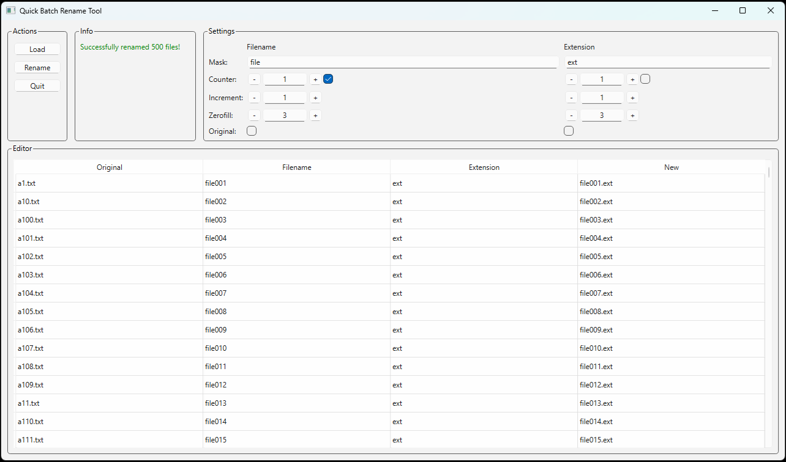

# Quick Batch Rename Tool

English guide here: [README.md](README.md)

Výkonný a jednoduchý nástroj na hromadné premenovanie súborov s pokročilými možnosťami a ukážkou v reálnom čase.

## Funkcie

- Používateľsky prívetivé grafické rozhranie - Intuitívne používanie
- Ukážka v reálnom čase - Vidíte, ako budú vaše súbory premenované pred aplikovaním zmien
- Pokročilé možnosti premenovania:
    - Použitie masiek na názvy súborov a prípony
    - Pridanie sekvenčných počítadiel k názvom súborov a/alebo príponám
    - Prispôsobenie začiatku počítadla, prírastku a doplnenia nulami
    - Zachovanie pôvodného názvu súboru alebo prípony
- Detekcia duplicít - Automatická detekcia a zvýraznenie potenciálnych konfliktov názvov
- Priama úprava - Úprava jednotlivých názvov súborov priamo v tabuľke
- Triedenie súborov - Abecedné zoradenie zoznamu súborov
- Podpora drag and drop - Jednoducho pretiahnite súbory do aplikácie
- Sledovanie postupu - Vizuálne sledovanie postupu počas premenovávania
- Dvojfázový proces premenovania - predchádzanie konfliktom pri premenovávaní viacerých súborov

## Požiadavky

- Python 3.12
- PySide6 6.8.2.1

## Inštalácia

1. Nainštalujte [Python](https://www.python.org/) 3.12

2. Nainštalujte potrebné balíčky:
```bash
pip install PySide6==6.8.2.1
```

### Windows

Môžete si tiež stiahnuť Windows x64 exe súbor na stránke [Releases](https://github.com/AdamBudac/Quick-Batch-Rename-Tool/releases)

## Použitie

1. Spustite skript dvojklikom alebo v konzole:

```bash
python QuickBatchRenameTool.py
```

2. Načítajte súbory - Kliknite na tlačidlo "Načítať" alebo pretiahnite súbory do aplikácie

3. Nakonfigurujte nastavenia premenovania:
    - Zadajte text masky pre názov súboru a/alebo príponu
    - Povoľte počítadlá a nastavte hodnoty prírastku/doplnenia nulami
    - Vyberte, či chcete zachovať pôvodný názov súboru alebo prípony

4. Zobrazte ukážku zmien - Výsledky uvidíte v stĺpci "New"

5. Aplikujte zmeny - Kliknite na "Rename" pre premenovanie súborov

## GUI



## Licencia

Zadarmo
