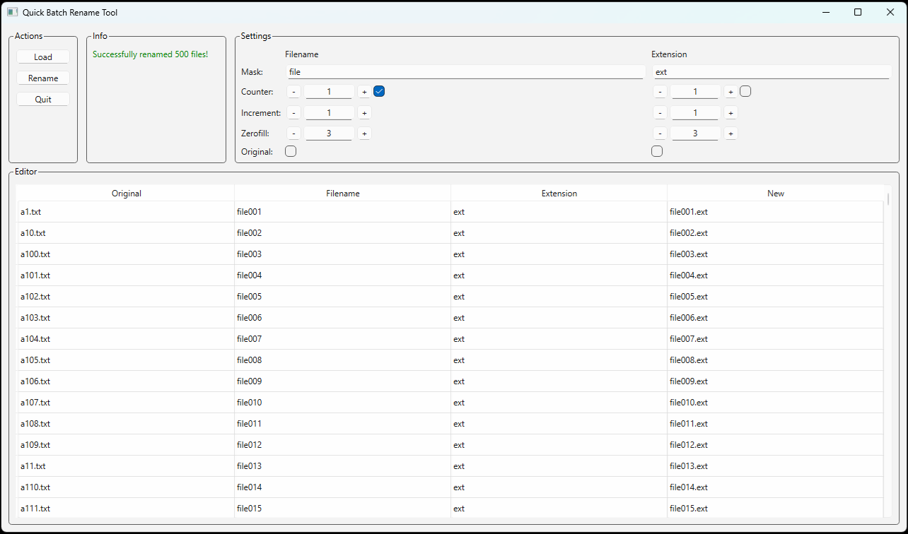

# Quick Batch Rename Tool

Slovenský návod tu: [README-SK.md](README-SK.md)

A powerful yet simple tool for batch renaming files with advanced options and real-time preview.

## Features

- User-friendly GUI - Clean, intuitive interface
- Real-time preview - See how your files will be renamed before applying changes
- Advanced renaming settings:
    - Apply masks to filenames and extensions
    - Add sequential counters to filenames and/or extensions
    - Customize counter start, increment and zero-fill
    - Keep original filename or extension
- Duplicate detection - Automatic detection and highlighting of potential naming conflicts
- Direct editing - Edit individual filenames directly in the table
- File sorting - Sort the file list alphabetically
- Drag and drop support - Simply drag and drop files into the application
- Progress tracking - Visual progress tracking during renaming operations
- Two-phase renaming process - avoid conflicts when renaming multiple files

## Requirements

- Python 3.12
- PySide6 6.8.2.1

## Installation

1. Install [Python](https://www.python.org/) 3.12 

2. Install the required packages:
```bash
pip install PySide6==6.8.2.1
```

### Windows

You can also download Windows x64 binary on the [Releases](https://github.com/AdamBudac/Quick-Batch-Rename-Tool/releases) page

## Usage

1. Run the script by double-clicking or in the console:

```bash
python QuickBatchRenameTool.py
```

2. Load files - Click the "Load" button or drag and drop files into the application

3. Configure renaming settings:
    - Enter mask text for filename and/or extension
    - Enable counters and set increment/zero-fill values
    - Choose whether to keep original filename or extension

4. Preview changes - See the results in the "New" column

5. Apply changes - Click "Rename" to rename the files

## GUI



## License

Free
